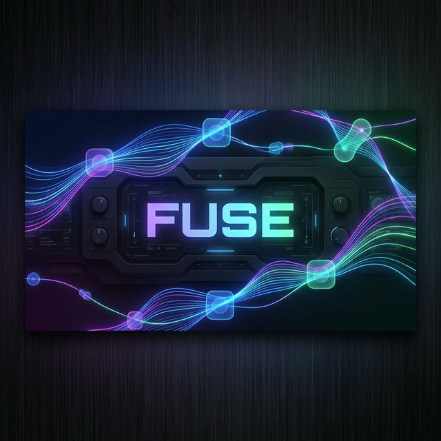

<p align="center">
  
</p>

# <p align="center">⚡ FUSE ⚡</p>

### <p align="center">**The Premium Configuration Hub for Quickshell.**</p>

<p align="center">
  
  
  
  
</p>

---

## 🌟 Overview

**Fuse** is a high-end, modern system settings application designed as the central nervous system for the **Alloy ecosystem**. Built with the performance of **Rust** and the sleek aesthetics of **GTK4/Libadwaita**, Fuse provides a unified and intuitive interface to control every aspect of your Quickshell environment.

## ✨ Key Features

| Category | Description |
| :--- | :--- |
| **🎨 Appearance** | Synchronize system-wide colors, manage dynamic themes, and fine-tune your look. |
| **🖼️ Wallpapers** | Integrated wallpaper manager with ultra-fast previews and categorization. |
| **📊 System Bar** | Granular control over layout, widgets, and behavior of your desktop bars. |
| **🌐 Connectivity** | Modern, responsive interfaces for managing Bluetooth and Network stacks. |
| **🔊 Audio Hub** | Professional-grade volume controls and source management. |
| **🔔 Notifications** | A unified center for managing alerts, history, and "Do Not Disturb" modes. |
| **⚙️ Deep Tweaks** | Access core Quickshell engine settings and custom script hooks. |

## 🚀 Getting Started

### Quick Install

Deploy Fuse instantly using our optimized installation script:

```bash
git clone https://github.com/alloy-team/fuse.git
cd fuse
chmod +x install.sh
./install.sh
```

> [!TIP]
> The script automatically detects your environment and ensures all dependencies (including the Rust toolchain) are correctly configured.

### Manual Build

For developers and enthusiasts:

```bash
# Build and run immediately
cargo run --release
```

## 🛠️ Performance & Architecture

Fuse is engineered for speed and reliability. By utilizing:
- **`tokio`**: For non-blocking, asynchronous system interactions.
- **`libadwaita`**: To provide a native, responsive, and adaptive UI.
- **`serde`**: For lightning-fast configuration parsing and serialization.

## 🧑‍💻 Contribution

We welcome contributions! Whether it's adding new features, improving documentation, or reporting bugs, feel free to open a PR or Issue.

---

<p align="center">
  Built with ❤️ by <b>artwik22</b> & the Alloy Team.
</p>
